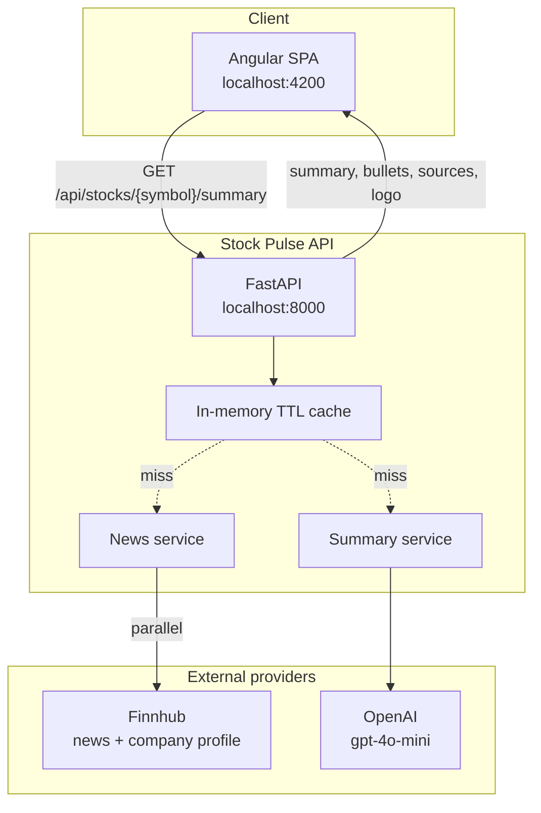

# Stock Pulse

Stock Pulse is a small app that turns recent company news into a short, trader-friendly summary. You type a ticker like `AAPL`, the Angular UI asks the FastAPI backend for a summary, and the backend pulls news from Finnhub, asks OpenAI to distill it, and sends back readable text plus source links.

Think of it as a quick “what’s going on with this stock?” brief — not a research terminal.

## Demo

End-to-end flow: enter a ticker, pick a news period (1 / 7 / 30 days), generate an AI summary, and browse key points plus sources.


A higher-quality version lives at [`docs/screenshots/demo.mp4`](docs/screenshots/demo.mp4).

## What you get

- Look up a ticker from a simple, responsive UI
- Filter news by period: last 1 day, 7 days, or 30 days
- Pull company news from Finnhub for the selected window
- Load company name and logo in parallel from Finnhub’s profile endpoint
- Get a short summary and bullet points from OpenAI (`gpt-4o-mini` by default)
- See sources with clickable links, plus related tickers as chips
- Quick-suggestion tickers and auto-uppercase symbol input
- In-memory caching for repeated lookups (response includes a `cached` flag)

## Stack

| Layer         | Technology                                               |
| ------------- | -------------------------------------------------------- |
| Frontend      | Angular 19 (standalone), Angular Material, RxJS, Jest    |
| Backend       | FastAPI, Pydantic v2, httpx, uvicorn                     |
| External APIs | Finnhub (company news + profile), OpenAI (summarization) |
| Testing       | pytest (backend), Jest (frontend)                        |

## System architecture

At a high level, the browser talks only to our API. The API owns the keys, fetches news and profile data, optionally serves a cached result, and calls OpenAI when it needs a fresh summary.



### Request flow

1. User enters a symbol in the Angular UI.
2. Frontend calls `GET /api/stocks/{symbol}/summary`.
3. Backend validates and normalizes the symbol, then checks the TTL cache.
4. On a miss, it fetches Finnhub news and company profile **in parallel**.
5. News is sent to OpenAI for a structured JSON summary (no invented facts).
6. Response comes back with company identity, summary, bullets, sources, and a `cached` flag.

API keys never leave the server. A missing company profile won’t block the summary. If there’s no recent news or an upstream call fails, the API returns a clear error instead of making something up.

```text
Browser (Angular)
    │  GET /api/stocks/{symbol}/summary
    ▼
FastAPI
    ├─ validate & normalize symbol
    ├─ TTL cache lookup
    ├─ Finnhub company news  ─┐
    ├─ Finnhub company profile ┘ (parallel)
    ├─ OpenAI JSON summary
    └─ response: company_name, logo_url, summary, bullets, sources
```

## Prerequisites

- Python 3.11+
- Node.js 20+
- [OpenAI API key](https://platform.openai.com/api-keys)
- [Finnhub API key](https://finnhub.io/register) (free tier is enough)

## Configuration

Copy `backend/.env.example` to `backend/.env` and fill in your keys:

| Variable            | Required | Default                 | Description                                |
| ------------------- | -------- | ----------------------- | ------------------------------------------ |
| `OPENAI_API_KEY`    | yes      | —                       | OpenAI credentials                         |
| `FINNHUB_API_KEY`   | yes      | —                       | Finnhub credentials                        |
| `OPENAI_MODEL`      | no       | `gpt-4o-mini`           | Chat model used for summaries              |
| `CACHE_TTL_SECONDS` | no       | `300`                   | In-memory cache lifetime                   |
| `CORS_ORIGINS`      | no       | `http://localhost:4200` | Allowed frontend origins (comma-separated) |
| `LOG_LEVEL`         | no       | `INFO`                  | Application log level                      |

## Setup

### Backend

```bash
python -m venv .venv
# Windows
.\.venv\Scripts\activate
# macOS / Linux
source .venv/bin/activate

pip install -r backend/requirements.txt
# Windows
copy backend\.env.example backend\.env
# macOS / Linux
# cp backend/.env.example backend/.env
```

Start the API from the `backend` directory so `.env` loads correctly:

```bash
cd backend
uvicorn app.main:app --reload --port 8000
```

- API: [http://localhost:8000](http://localhost:8000)
- OpenAPI docs: [http://localhost:8000/docs](http://localhost:8000/docs)

### Frontend

```bash
cd frontend
npm install
npm start
```

App: [http://localhost:4200](http://localhost:4200)

## API

### `GET /health`

```json
{ "status": "ok" }
```

### `GET /api/stocks/{symbol}/summary`

Returns an AI summary for the given ticker.

**Success (`200`)**

```json
{
  "symbol": "AAPL",
  "company_name": "Apple Inc",
  "logo_url": "https://static2.finnhub.io/file/publicdatany/finnhubimage/stock_logo/AAPL.svg",
  "summary": "...",
  "bullets": ["...", "..."],
  "sources": [
    {
      "title": "...",
      "url": "https://...",
      "source": "...",
      "published_at": "2026-07-20T12:00:00Z",
      "related_symbols": ["AAPL", "MSFT"]
    }
  ],
  "generated_at": "2026-07-20T12:05:00Z",
  "cached": false
}
```

**Errors**

| Status | When                               |
| ------ | ---------------------------------- |
| `400`  | Invalid symbol                     |
| `404`  | No recent news for the symbol      |
| `502`  | Finnhub or OpenAI upstream failure |

## Project layout

```text
backend/
  app/
    api/           Route handlers
    services/      Finnhub news/profile + OpenAI summary
    cache.py       In-memory TTL cache
    config.py      pydantic-settings env config
    models.py      Request/response schemas
    main.py        App factory & lifespan
  tests/           pytest suite (mocked externals)
frontend/
  src/app/         Angular UI, HTTP service, models
  src/environments API base URL (dev/prod)
```

## Why things are built this way

A few choices worth calling out:

| Choice                         | Why we did it                                                                                 |
| ------------------------------ | --------------------------------------------------------------------------------------------- |
| Angular + FastAPI              | Typed SPA and async Python API with OpenAPI docs and a clean split between UI and orchestration |
| Finnhub as the news source     | Stable REST API — no brittle HTML scraping                                                    |
| Finnhub profile for logo/name  | Company identity isn’t in the news payload; profile2 is the right source                      |
| Soft-fail on profile           | Logo/name are nice-to-have; missing profile still returns a full summary                      |
| `related_symbols` on sources   | Finnhub’s `related` field surfaces co-mentioned tickers without extra calls                   |
| Server-side OpenAI calls       | Keeps API keys off the client                                                                 |
| Explicit empty/error responses | Never invent headlines when news is missing or providers fail                                 |
| In-memory TTL cache            | Fast repeated local lookups without standing up Redis or similar                              |
| Responsive single-page UI      | Brand-led hero, suggestion chips, and a layout that works across breakpoints                  |
| pydantic-settings              | Typed config with `.env` loading                                                              |
| stdlib logging                 | Enough observability for a single-process service (logs land in the uvicorn terminal)         |
| pytest + Jest with mocks       | Fast, deterministic tests without hitting live APIs                                           |

## Tests

External providers are mocked, so you don’t need live Finnhub or OpenAI keys to run the suite.

### Backend

```bash
.\.venv\Scripts\python -m pytest backend/tests -q
```

Coverage includes symbol validation, Finnhub news/profile normalization (including `related_symbols`), prompt/JSON parsing, happy path, cache hits, empty news (`404`), and upstream failures (`502`).

### Frontend

```bash
cd frontend
npm test
```
